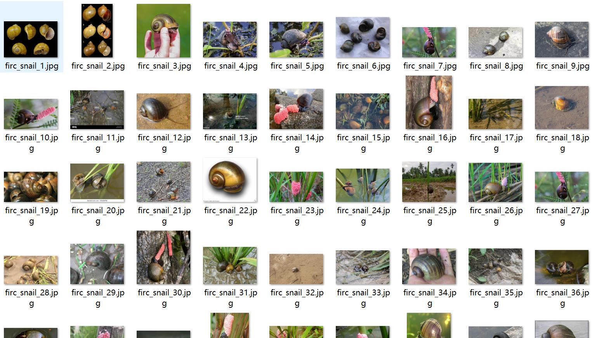
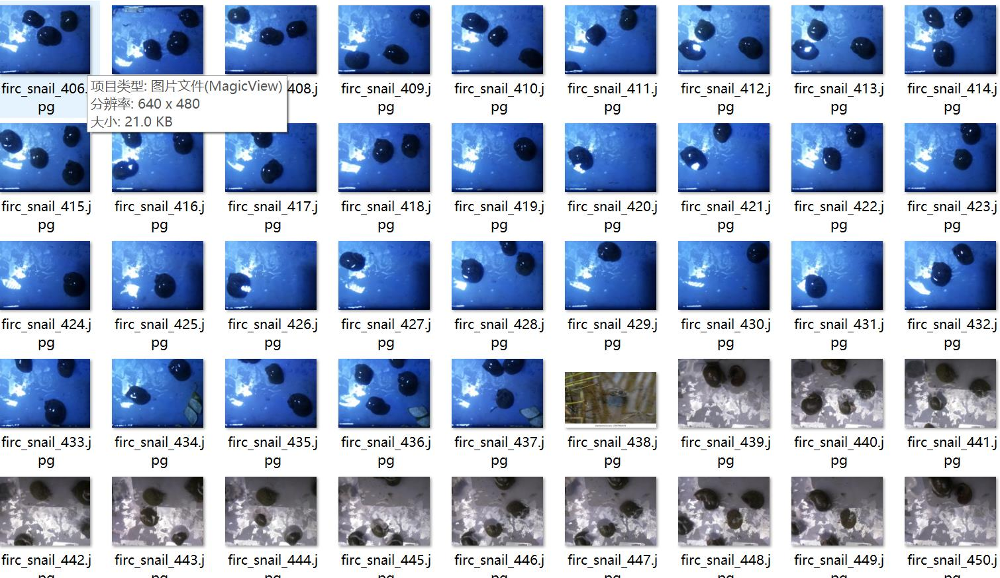
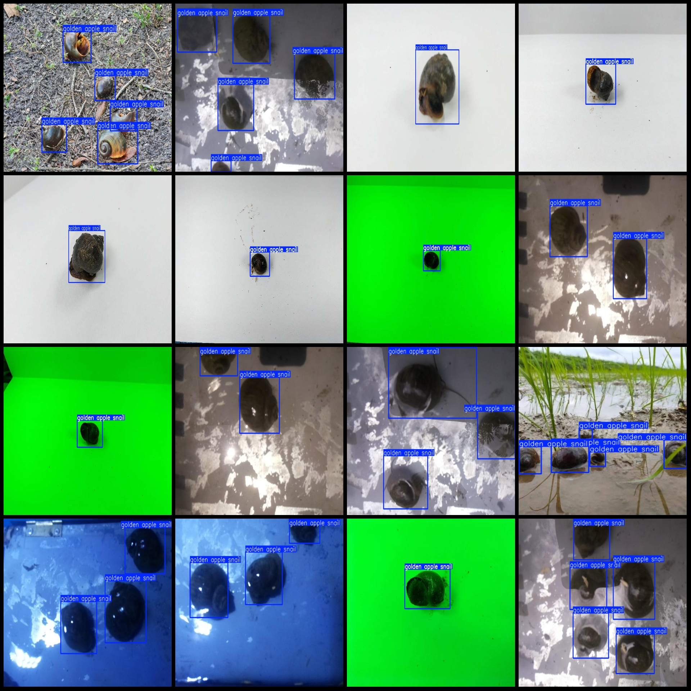
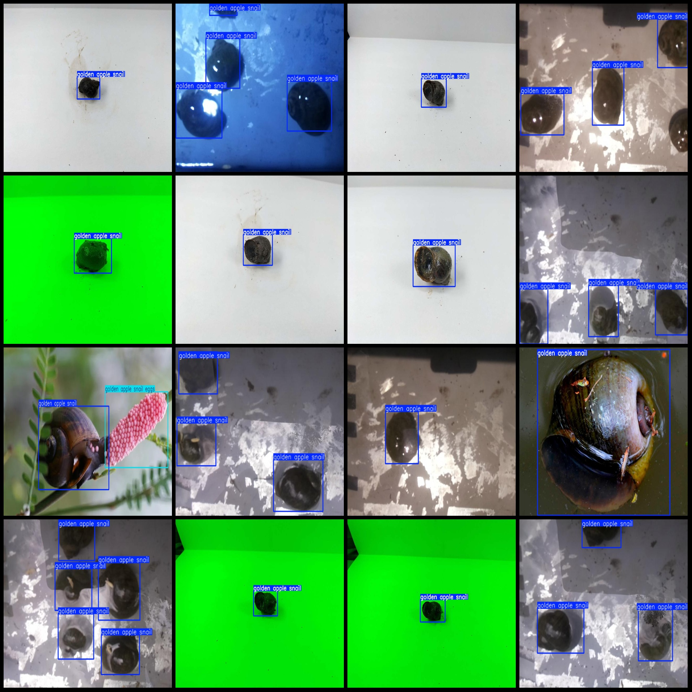

# Dataset: Fusoulu Detection Dataset (VOC+YOLO)

## Dataset Format: Pascal VOC format + YOLO format (without split path txt files, just containing jpg images along with corresponding VOC format xml files and yolo format txt files)

### Image Count (Number of JPG Files): 545

### Annotation Count (Number of XML Files): 545

### Annotation Count (Number of TXT Files): 545

### Number of Annotation Categories: 2

### Annotation Category Names (Note that the order of categories in the yolo format is not consistent with this, and the labels folder's classes.txt is used as the reference): ["golden apple snail", "golden apple snail eggs"]

Each category has:
- Golden Apple Snail (Fusoulu) boxes = 1012
- Golden Apple Snail Eggs (Fusoulu Eggs) boxes = 75
Total boxes = 1087

Image resolutions: Multi-resolution images, such as 1024x768, 640x480, etc.

Usage Annotation Tool: labelImg
Annotation Rules: Draw a box around the category

Important Notice: The dataset does not have been divided into training, validation, and test sets, so they need to be manually divided.

Special Remark: This dataset does not guarantee the accuracy of the models or weight files trained on it.

Image Preview:

---

annotation example
## Images

Here is a pay link on Stripe ( https://buy.stripe.com/3cs8yP7sY87d0vu9AB ). Please contact me lonlonago@foxmail.com after funding $89, and I will send you a complete data files , thank you!

